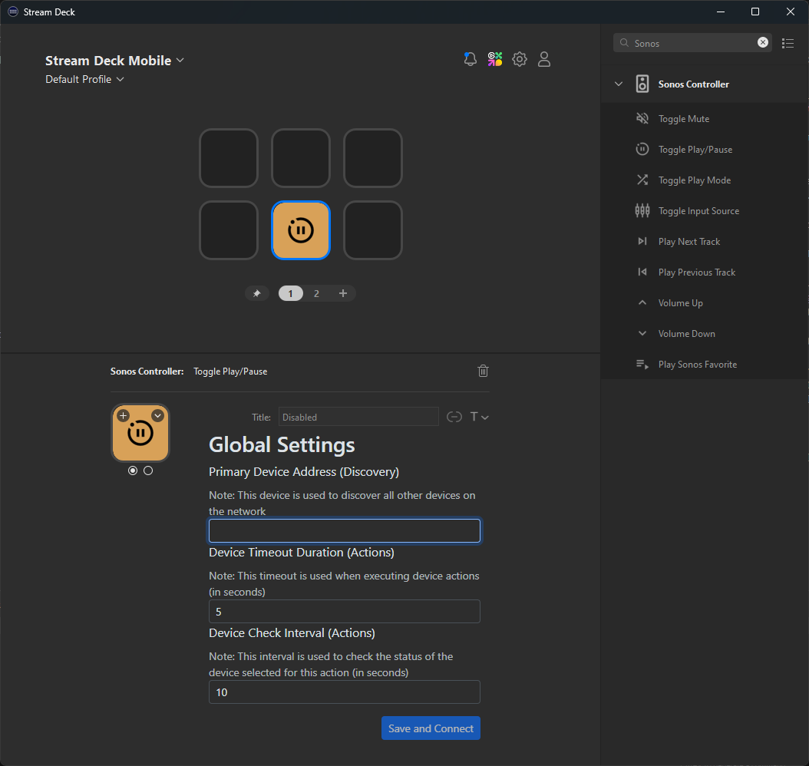
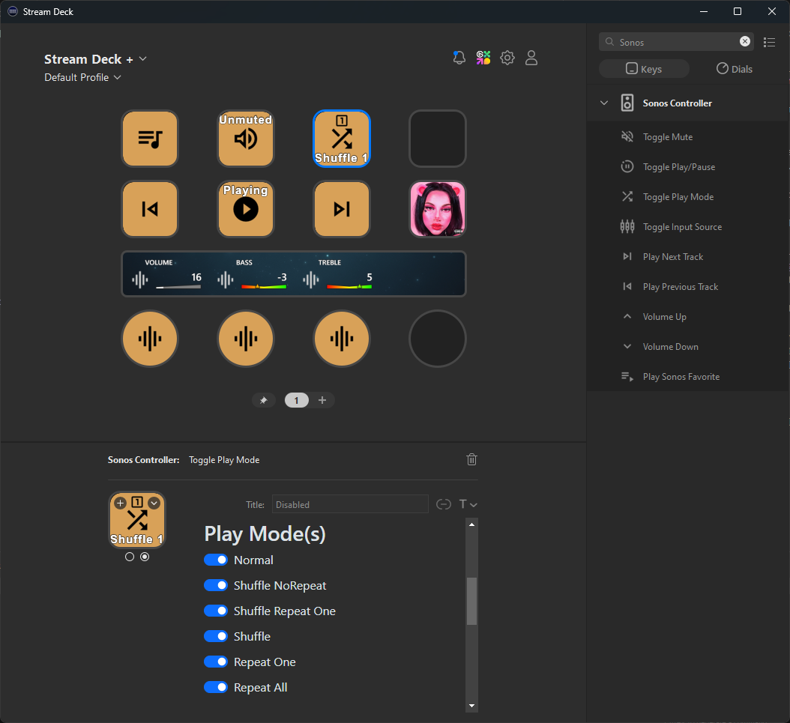

# StreamDeck Sonos Controller

## Overview

The StreamDeck Sonos Controller plugin allows you to manage your Sonos devices seamlessly from a single StreamDeck interface. This plugin has been refactored to enhance functionality and user experience, building upon the original work by [GenericMale](https://github.com/GenericMale/streamdeck-sonos/).

## Features

- **Manage Multiple Devices**: Control multiple Sonos devices from a single StreamDeck.
- **Encoder Dials**: Adjust Bass, Treble, and Volume using encoder dials for precise control.
- **Improved Interval Polling**: Enhanced performance with better polling intervals for device status.
- **Marquee-Based Titles**: Support for marquee titles to display dynamic information.

## Installation

### Manual installation    
* Download the latest plugin release [here](https://github.com/r-teller/streamdeck-sonoscontroller/releases)
* Open the downloaded .streamDeckPlugin file. It will be automatically installed into your Stream-Deck application

### Initial Setup

During initial setup, you must provide a "Discovery" device IP address. This is the first node that will be queried by the plugin, allowing it to discover adjacent nodes and list them as available speakers to manage.

- **Default Discovery Timeout**: 5 seconds
- **Default Action Timeout**: 10 seconds

### Selecting a Sonos Speaker

By default, the initial speaker discovered is set as the default for new actions added. You can change this setting as needed.

### Toggle Play Modes

Some keys support multiple actions in a toggle format, working through the list of enabled actions from top to bottom. If certain actions are not supported or desired for your device, you can uncheck any item that you do not wish to apply.

## Supported Actions

The StreamDeck Sonos Controller supports the following actions:

1. **Toggle Mute**

   - Toggles the mute state between muted and unmuted, allowing you to quickly silence or restore sound.

2. **Toggle Play/Pause**

   - Switches between playing and paused states, enabling you to control playback effortlessly.

3. **Toggle Play Mode**

   - Changes the play mode among the following options:
     - **Normal**: Plays tracks in the order they appear in the playlist.
     - **Shuffle_NoRepeat**: Plays tracks in a random order without repeating any track until all have been played.
     - **Shuffle_Repeat_One**: Plays the current track in a loop while shuffling the rest.
     - **Shuffle**: Plays tracks in a random order, allowing repeats.
     - **Repeat_One**: Repeats the current track indefinitely.
     - **Repeat_All**: Repeats the entire playlist indefinitely, ensuring continuous playback.

4. **Toggle Input Source**

   - Switches between different input sources, such as Sonos Queue, TV Input, and Line-In, for versatile audio management.

5. **Play Next Track**

   - Skips to the next track in the queue, ensuring continuous playback of your playlist.

6. **Play Previous Track**

   - Returns to the previous track in the queue, allowing you to replay your favorite songs.

7. **Volume Up**

   - Increases the volume by a set increment, enhancing your listening experience.

8. **Volume Down**

   - Decreases the volume by a set increment, providing control over audio levels.

9. **Play Sonos Favorite**

   - Plays a designated Sonos favorite, giving you quick access to your preferred music.

10. **Audio Equalizer**

    - Adjusts audio equalizer settings to customize sound quality. It supports adjustments for:

      - **Volume**: Control the overall loudness.
      - **Treble**: Adjust the higher frequencies for clarity.
      - **Bass**: Modify the lower frequencies for depth and richness.

## Contributing

Feel free to submit issues or pull requests. Contributions are welcome!

## License

This project is licensed under the MIT License - see the [LICENSE](LICENSE) file for details.
